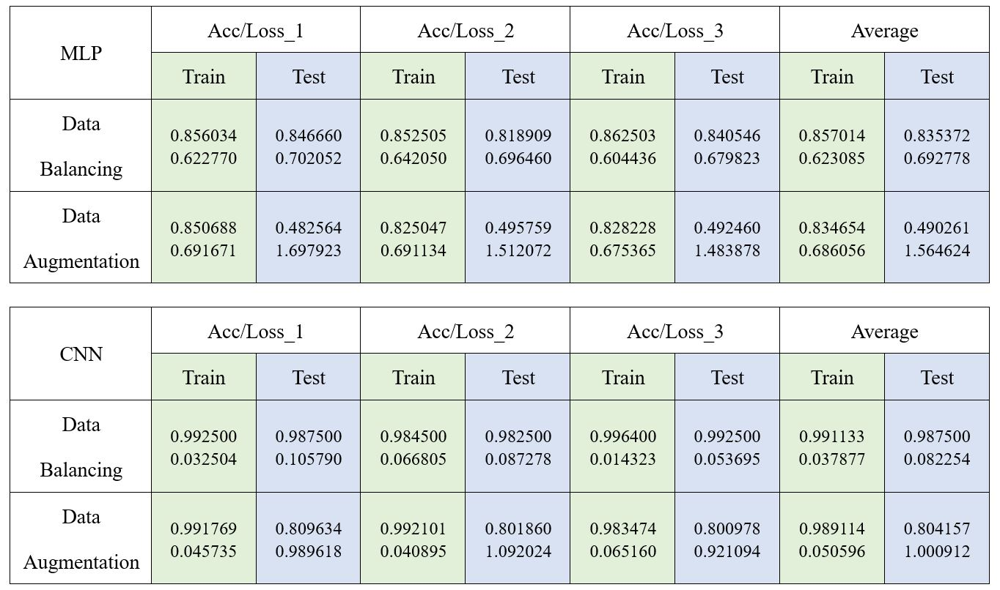
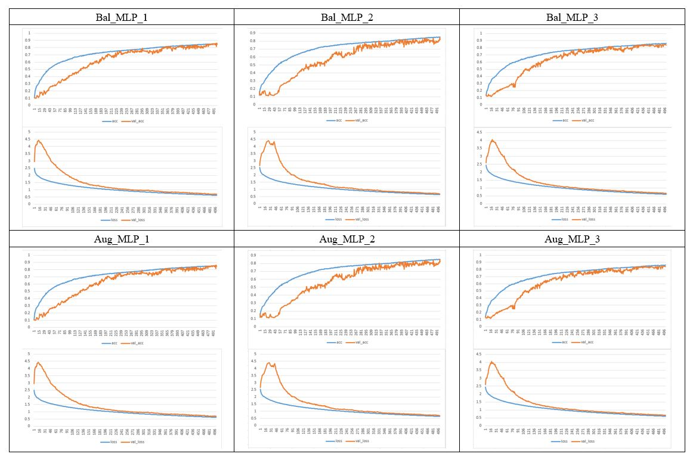
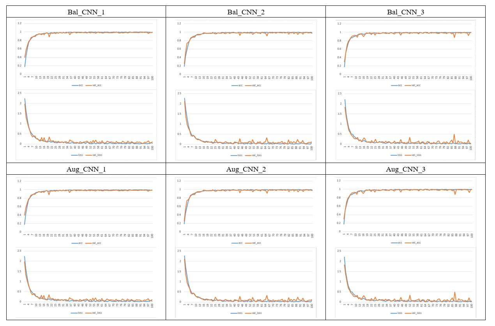

# MLP_CNN_Comparison_Test

## Overview

Hello all,
There are 10 classes of reclaim wafer defective feature maps in the dataset. 
Two type of dataset preprocessing to test with CNN and MLP 

`Augmentation` `Balencing`

MLP got  a terrible training result, the ACC is about 80% only.
But the training result of CNN is outstanding except the AlexNet, the average of the ACC is about 98%.
Hope you love this project !

## Result

**Table:**

**Plot:**

(MLP)

(CNN)

